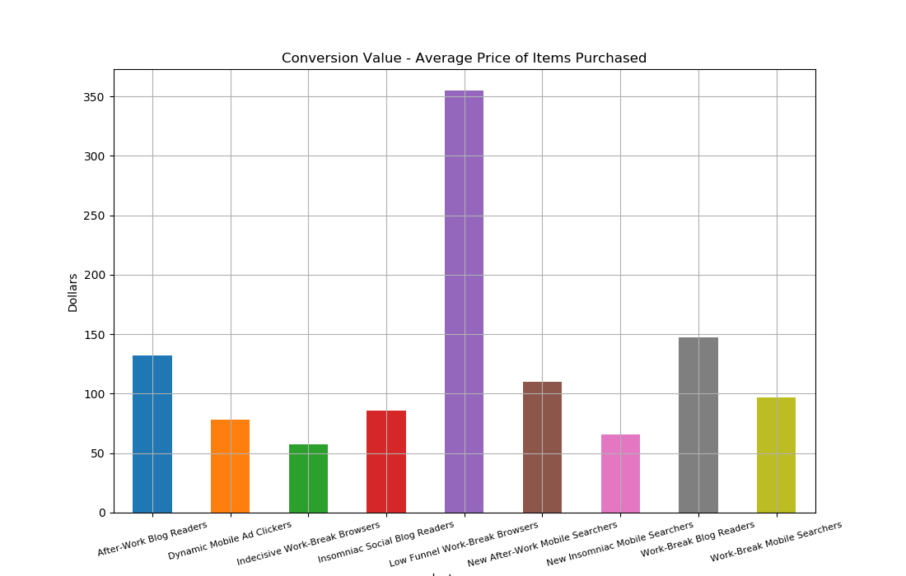

# Ecommerce Traffic Segmentation
## Unsupervised Learning – Clustering


### Question
Can website sessions be clustered by how and when users arrive at the site? If so, how can clusters be used to inform marketing decisions?  

### Data
I used data from the Google Merchandise online store. https://shop.googlemerchandisestore.com/ Google Analytics data from August 1, 2016 - August 1, 2017 (>200,000 web sessions) is publicly available on Google Big Query. I used SQL to query 4 months of website sessions, where one row represents one session.


```sql
sql query here
```

### Features
* Number of site visits – new or returning visitor
* Device – desktop or mobile
* Traffic medium – organic, paid, referral or affiliate
* Social referral - driven from social media or not
* Time of day – morning, afternoon, evening or night

### Clustering
Sklearn's Kprototypes is a combination of KMeans and KModes. It's used for clustering a mix of numeric and categorical features. When fitting, KPrototypes takes the categorical indicies as an argument and clusters accordingly.

```python
def get_labels(k):
  init = 'Huang'
  n_clusters = 8
  max_iter = 100

  kproto = kprototypes.KPrototypes(n_clusters=k,init=init, max_iter=max_iter)

  categoricals_indicies = [1,2,3,4,5,6,7,8,9]
  labels = kproto.fit_predict(X_scaled, categorical=categoricals_indicies)
  return labels
```

### Picking Ideal # of Clusters

##### Elbow


##### Principle Component Analysis
 

##### Silouette


### Cluster Features
To interpret feature information about each cluster, I added a labels column to the original features dataframe, grouped by cluster, and aggregated column-wise by the mean.

|   cluster |   num visits |   social referral |   device |   organic |   paid |   referral/affiliate |   night |   morning |   afternoon |   evening |
|----------:|-------------:|------------------:|---------:|----------:|-------:|---------------------:|--------:|----------:|------------:|----------:|
|         0 |         1.99 |              0.02 |     0.73 |      0.1  |   0.85 |                 0.05 |    0.23 |      0.24 |        0.2  |      0.22 |
|         1 |         1.48 |              0    |     0.37 |      0.95 |   0.05 |                 0    |    0.98 |      0.01 |        0    |      0    |
|         2 |         2.1  |              0.05 |     0.02 |      0    |   0.01 |                 0.99 |    0    |      0.06 |        0.83 |      0    |
|         3 |         1.37 |              0    |     0.28 |      0.94 |   0.06 |                 0    |    0    |      0.11 |        0    |      0.79 |
|         4 |         2.58 |              0.1  |     0.05 |      0    |   0.01 |                 0.99 |    0.9  |      0.03 |        0    |      0    |
|         5 |       157.64 |              0    |     0    |      0.4  |   0    |                 0.6  |    0.2  |      0    |        0.6  |      0.2  |
|         6 |        26.7  |              0.03 |     0.03 |      0.25 |   0.03 |                 0.72 |    0.18 |      0.03 |        0.33 |      0.39 |
|         7 |         1.7  |              0    |     0.24 |      0.95 |   0.05 |                 0    |    0    |      0.02 |        0.95 |      0    |
|         8 |         2.29 |              0.04 |     0.02 |      0    |   0.01 |                 0.99 |    0    |      0    |        0    |      1    |


### Interpretation
Below is a qualitative interpretation of cluster features based on the means of each column. Also added is column for cluster 'name' and size.

| Cluster Name | Size  |Number of Visits | Social Referral | Device | Traffic Medium | Time of Day |
| -- |:----:| ---:| ---:|----: |:----:| ---:|
|Dynamic Mobile Ad Clickers | 324 | Second Visit | No | Mobile | Paid | All day |
|New Insomniac Mobile Searchers | 948 | New Visitor | No | Some Mobile | Organic | Night |
|Work-Break Blog Readers | 1268 | Second Visit | No | Desktop | Referral/Affiliate | Afternoon |
|New After-Work Mobile Searchers | 1461 | New Visitor |  No | Some Mobile | Organic | Evening |
|Insomniac Social Blog Readers | 780 | 2-3 Visits | Some Social Referral  | Desktop | Referral/Affiliate | Night
|Very Indecisive Work-Break Browsers| 5 | Very Frequent Visitor | No | Desktop | Organic & Ref/Affil | Mostly Afternoon, Not AM |
|Indecisive Work-Break Browsers| 72 | Frequent Visitor | No | Desktop | Organic & Ref/Affil | Mostly Afternoon, Not AM |
|Work-Break Mobile Searchers| 938 | Second Visit | No  | Some Mobile | Organic | Afternoon |
|After-Work Blog Readers| 1452 |Second Visit | No  | Desktop | Referral/Affiliate | Evening |

### Clustering Insights
* Referral/Affiliate coming through desktop, return users
*
### Cluster Performance Insights
To see how each cluster performed on the site, I created a 'Y' dataframe with some additional columns.

```python
Y['conversion_rate'] = Y['num_transactions'] / Y['num_visits']
Y['avg_conversion_value'] = Y['revenue'] / Y['num_transactions']
```

|   cluster |   page_views |   time_on_site |   num_visits |   num_transactions |   revenue |   action_type |   conversion_rate |   conversion_value |   size |
|----------:|-------------:|---------------:|-------------:|-------------------:|----------:|--------------:|------------------:|-------------------:|-------:|
|         0 |        12.17 |           7.8  |       645.58 |              25    |   1951.52 |          1.82 |              0.04 |              78.06 |    324 |
|         1 |        12.82 |           7.57 |      1399.11 |              77    |   5056.15 |          1.91 |              0.06 |              65.66 |    948 |
|         2 |        14.41 |           9.08 |      2662.91 |             348.5  |  51397.1  |          2.87 |              0.13 |             147.48 |   1268 |
|         3 |        12.6  |           8.34 |      2006.35 |             138.67 |  15215.2  |          1.92 |              0.07 |             109.73 |   1461 |
|         4 |        14.33 |           8.73 |      2015.97 |             190    |  16243.4  |          2.75 |              0.09 |              85.49 |    780 |
|         5 |        15.28 |          15.2  |       788.19 |               2    |    114.58 |          3.4  |              0    |              57.29 |      5 |
|         6 |        16.27 |          12.32 |      1922.67 |              22    |   7813.41 |          3.08 |              0.01 |             355.15 |     72 |
|         7 |        13    |           9.01 |      1590.4  |             123.33 |  11962    |          2.2  |              0.08 |              96.99 |    938 |
|         8 |        14.4  |           8.88 |      3326.27 |             401.67 |  53081.4  |          2.91 |              0.12 |             132.15 |   1452 |
* paid traffic leans mobile
* new visitors lean mobile (except for paid traffic), return visitors lean desktop
*

### EDA

* afternoon browsers spend more time on site





### Future Work

### Conclusion
